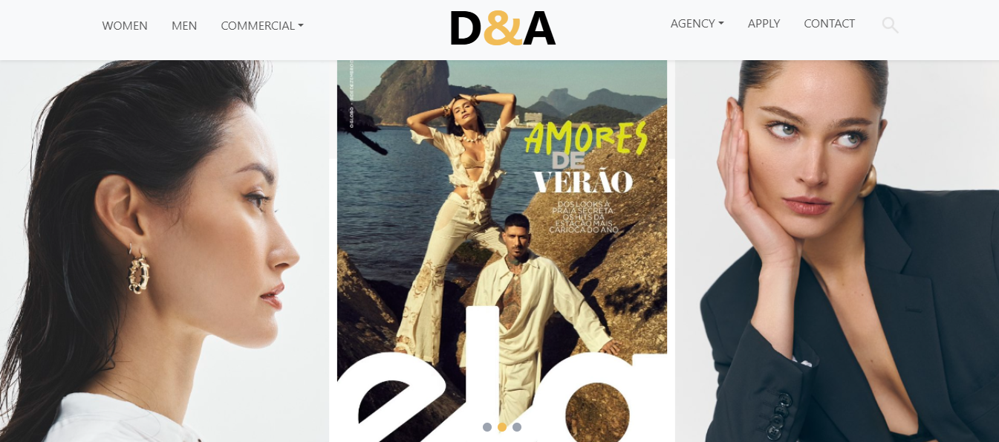

# Modeling Portfolio Website

A sleek and professional modeling portfolio platform built with React and modern web technologies. Showcase talent across multiple categories with an intuitive search system and seamless user experience.

## 🌐 Live Demo

**[View Live App](https://d-a-models.vercel.app/)**

## Screenshot📸


## ✨ Features

- **Dynamic Hero Section**: Eye-catching landing page with prominent apply button
- **Hero Image Slider**: A dynamic image slider on the homepage that:
  - Automatically changes images every 4 seconds
  - Includes smooth transitions for a modern feel
  - Provides navigation dots for manual control

- **Category Navigation**: Organized model portfolios across multiple categories:
  - Men's Portfolio
  - Women's Portfolio  
  - Kids' Gallery
  - Baby Models
  - Boys' Section
  - Girls' Section
- **Smart Search**: Instantly find models by name with real-time filtering
- **Application System**: Dedicated apply page for aspiring models
- **Contact Integration**: Professional contact page for inquiries and collaborations
- **Responsive Design**: Optimized viewing experience across all devices
- **Modern UI**: Clean, professional interface with smooth navigation

## 🛠️ Technologies Used

- **React.js** - Component-based frontend framework
- **React Router** - Client-side routing and navigation
- **Tailwind CSS** - Utility-first styling framework
- **Bootstrap** - Additional UI components and responsive utilities
- **Vercel** - Fast and reliable deployment platform

## 🚀 Getting Started

### Prerequisites

- Node.js 
- npm or yarn package manager

### Installation

1. Clone the repository:
   ```bash
   git clone https://github.com/Alvinza/D-A-Models.git
   cd modeling-website
   ```

2. Install dependencies:
   ```bash
   npm install
   # or
   yarn install
   ```

3. Start the development server:
   ```bash
   npm start
   # or
   yarn start
   ```

4. Open your browser and navigate to `http://localhost:3000`

## 📖 How to Use

1. **Browse Portfolio**: Explore different model categories from the main navigation
2. **Search Models**: Use the search bar to find specific talent by name
3. **Model Applications**: Click "Apply" to submit your modeling application
4. **Get in Touch**: Visit the contact page for business inquiries
5. **Mobile Experience**: Enjoy full functionality on any device


## 📞 Contact

For business inquiries, collaborations, or technical questions:
- Email: alvinzondi@gmail.com
- Website: [Contact Page](https://d-a-models.vercel.app/contact)

---

**Discover exceptional talent and build your next project! **
